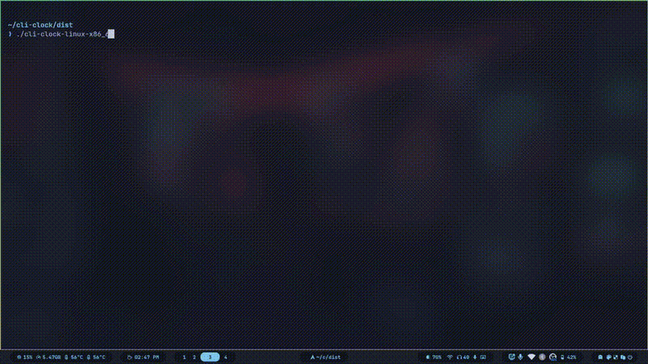

# TickTerm

>  Time, perfectly ticked — Clock • Stopwatch • Timer — All in your terminal

<div align="center">
  
</div>

<br/>

---

<br/>

## ▸ Features

**TickTerm** is your all-in-one terminal time companion, offering three powerful modes:

### ◆ Clock Mode
Watch time flow with a stunning retro-styled digital clock. Perfect for keeping time visible in your terminal workspace.

### ◆ Stopwatch Mode
Precision timing at your fingertips. Track elapsed time with millisecond accuracy for productivity sessions, workouts, or any activity that needs timing.

- Start, stop, and resume functionality
- Visual lap time display
- Smooth real-time updates

### ◆ Timer Mode
Countdown timer with an intuitive setter interface. Set hours, minutes, and seconds with ease.

- Interactive time setter with up/down controls
- Pause and resume capability
- Visual countdown display
- Auto-reset on completion

<br/>

## ▸ Usage

Simply run the binary:
```bash
tickterm
```

<br/>

**Requirements:**
- Minimum terminal size: `76 × 10`
- Unicode and color support recommended

<br/>
<br/>

## ▸ Key Bindings

### Global Controls
| Key | Action |
|-----|--------|
| `Esc` | Quit application |
| `i` | Toggle key bindings visibility |
| `b` | Back to clock mode |

### Mode Navigation
| Key | Action |
|-----|--------|
| `w` | Switch to Stopwatch mode |
| `t` | Switch to Timer mode |

### Stopwatch Controls
| Key | Action |
|-----|--------|
| `Tab` | Cycle through buttons (Start → Stop → Reset) |
| `Enter` | Activate selected button |

### Timer Controls
| Key | Action |
|-----|--------|
| `Tab` | Cycle through buttons (Start → Stop → Reset) or switch value segments in setter mode |
| `Enter` | Activate button or exit setter mode |
| `Up` / `Down` | Increase/decrease selected time segment (in setter mode) |

<br/>
<br/>

## ▸ Design Philosophy

TickTerm combines nostalgic pixel aesthetics with modern terminal capabilities. Each mode features:

- **Retro pixel art displays** for a vintage digital clock feel
- **Smooth animations** that don't compromise terminal performance
- **Intuitive controls** designed for keyboard-first workflows
- **Minimal resource usage** - perfect for always-on terminal sessions

<br/>

## ▸ Supported Platforms

<p align="center">
  <strong>Linux</strong>  •  <strong>macOS</strong>  •  <strong>Windows</strong>
</p>

<p align="center">
  <sub>Cross-platform support with native binaries for all major operating systems.</sub>
</p>

<br/>

---

<br/>

<div align="center">
  <sub>Built with ♥ using <a href="https://ratatui.rs/">Ratatui</a></sub>
</div>
